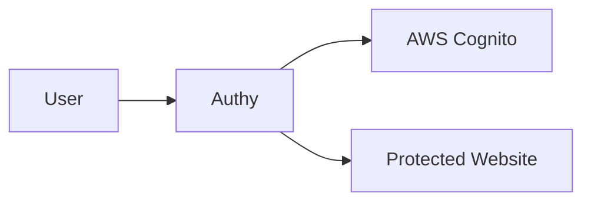

# Authy - OAuth2 Authentication Gateway

Authy is a secure authentication gateway written in Rust that provides controlled access to protected websites through Amazon Cognito authentication. It acts as a secure proxy that ensures only authenticated users can access protected resources.

## Features

- **OAuth2 Authentication**: Seamless integration with AWS Cognito
- **Secure Proxy**: Authenticated access to protected websites
- **High Performance**: Built with Rust for optimal speed and resource usage
- **Docker Ready**: Easy deployment with Docker and docker-compose
- **Health Checks**: Built-in health monitoring
- **CORS Support**: Configurable cross-origin resource sharing
- **Logging**: Structured logging with configurable levels
- **Memory Safe**: Leverages Rust's safety guarantees
- **Async I/O**: Efficient request handling with Tokio
- **Streaming**: Efficient handling of large requests/responses

## Quick Start

### Using Docker Compose (Recommended)

1. Clone the repository:
```bash
git clone https://github.com/FringeNet/authy.git
cd authy
```

2. Configure environment:
```bash
cp .env.example .env
# Edit .env with your AWS Cognito and service configuration
```

3. Start the service:
```bash
docker-compose up -d
```

4. Check the service:
```bash
curl http://localhost:3000/health
```

### Using Docker

```bash
docker run -d \
  -p 3000:3000 \
  -e COGNITO_DOMAIN=https://your-domain.auth.region.amazoncognito.com \
  -e COGNITO_CLIENT_ID=your-client-id \
  -e COGNITO_CLIENT_SECRET=your-client-secret \
  -e SERVER_DOMAIN=http://your-server-domain \
  -e PROTECTED_WEBSITE_URL=https://website-to-protect.com \
  --name authy \
  ghcr.io/fringenet/authy:latest
```

### Local Development

1. Install Rust:
```bash
curl --proto '=https' --tlsv1.2 -sSf https://sh.rustup.rs | sh
```

2. Build and run:
```bash
# Development
cargo run

# Run tests
cargo test

# Production build
cargo build --release
```

## Configuration

### Environment Variables

| Variable | Description | Required | Default |
|----------|-------------|----------|---------|
| `COGNITO_DOMAIN` | AWS Cognito domain URL | Yes | - |
| `COGNITO_CLIENT_ID` | AWS Cognito client ID | Yes | - |
| `COGNITO_CLIENT_SECRET` | AWS Cognito client secret | Yes | - |
| `SERVER_DOMAIN` | Public domain of this service | Yes | - |
| `PROTECTED_WEBSITE_URL` | URL to protect | Yes | - |
| `PORT` | Server port | No | 3000 |
| `RUST_LOG` | Log level | No | info |

### AWS Cognito Setup

1. Create a User Pool in AWS Cognito
2. Configure an App Client:
   - Enable OAuth2
   - Add callback URLs
   - Configure hosted UI
3. Note down the domain, client ID, and secret

## Architecture



1. **Authentication Flow**:
   - User attempts to access protected resource
   - Redirected to Cognito login
   - After login, receives authorization code
   - Code exchanged for access token
   - Access granted to protected resource

2. **Proxy Flow**:
   - Incoming request validated
   - JWT token verified
   - Request proxied to protected website
   - Response streamed back to user

## API Endpoints

- `GET /` - Entry point, redirects to login
- `GET /callback` - OAuth2 callback handler
- `GET /health` - Health check endpoint
- `/*` - Proxied to protected website

## Security Features

- OAuth2 authorization code flow
- HTTPS communication
- JWT token validation
- Request/response streaming
- Header filtering
- CORS configuration
- Non-root Docker user
- Health monitoring
- Access logging

## Development

### Project Structure

```
src/
├── auth/     # Authentication handling
├── config/   # Configuration management
├── error/    # Error types and handling
├── proxy/    # Proxy implementation
└── main.rs   # Application entry point
```

### Testing

```bash
# Run all tests
cargo test

# Run with logging
RUST_LOG=debug cargo test

# Run specific test
cargo test test_name
```

### Docker Build

```bash
# Build image
docker build -t authy .

# Build with different target
docker build --target builder .
```

## Contributing

1. Fork the repository
2. Create feature branch (`git checkout -b feature/xyz`)
3. Make changes and test
4. Commit (`git commit -am 'Add xyz'`)
5. Push (`git push origin feature/xyz`)
6. Create Pull Request

## License

MIT